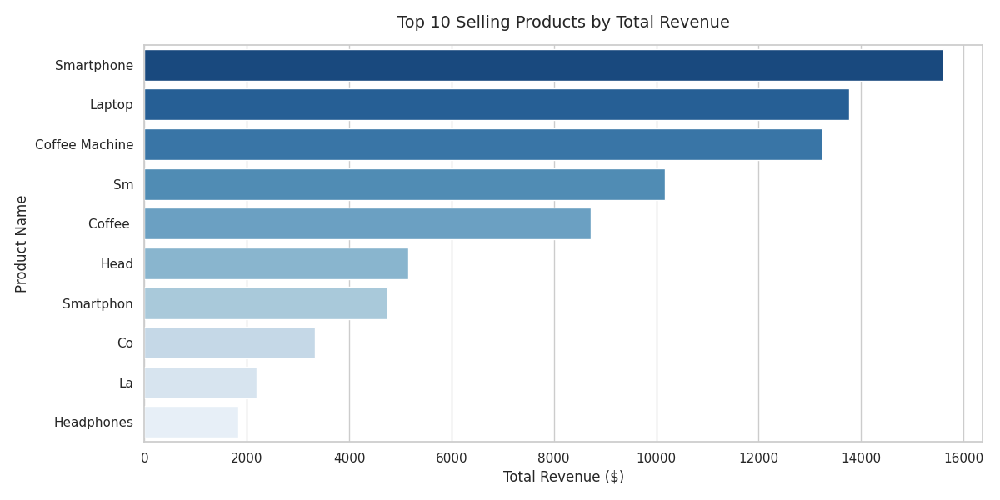
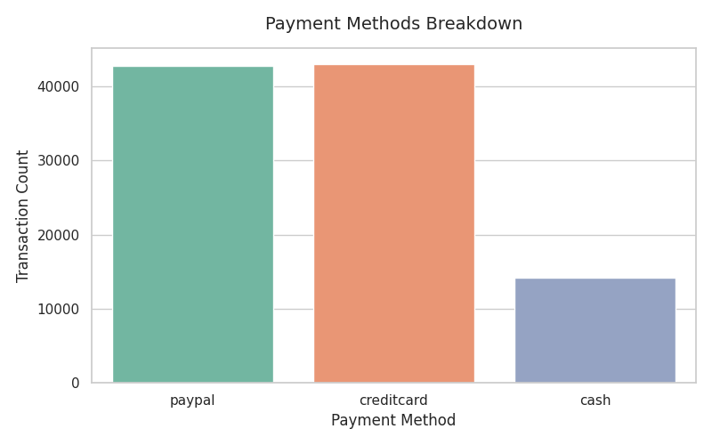

# Dirty Financial Transactions & Data Integrity Pipeline

## 📌 Project Overview
In real-world data environments, financial ledgers are rarely pristine. Upstream parsing errors, malformed entries, and edge-case transactions frequently compromise data quality. This project establishes a robust, automated data cleaning and auditing pipeline using **Python and Pandas** to transform a highly chaotic financial dataset into a production-ready, auditable asset.

Instead of silently deleting problematic records, this pipeline applies explicit business rules, standardizes malformed schemas, imputes missing values using structural group logic, and applies a detailed audit logging system. This ensures complete transparency for downstream data analysts and compliance teams.

---

## 🛠️ The Problem: Core Data Quality Issues Identified
Initial visual exploration and programmatic profiling revealed significant anomalies across the baseline ledger:
*   **Temporal Anomalies:** Broken, out-of-bounds, or completely invalid calendar dates (e.g., `2025-02-30`) resulting from upstream parsing system failures.
*   **Malformed Identifiers:** Structural irregularity in customer tracking codes, such as missing padding digits (e.g., `C847` and `C828` instead of matching the `CXXXX` profile).
*   **Logical Ledger Flaws:** Standard ledger entries presenting negative figures in the `Price` column, skewing accounting aggregates.
*   **Structural Gaps (Missing Data):** Undefined elements across critical transaction rows, specifically missing entries within the `Price`, `Quantity`, and `Transaction_Status` fields.

---

## 🚀 The Solution: Engineering Logic & Business Rules
The data pipeline executes a sequential remediation strategy to enforce absolute integrity across the rows:

### 1. Temporal Integrity & Validation
*   **Action:** Parsed and coerced dates to standard format. Invalid chronological records were isolated as `NaT`.
*   **Audit Logging:** Generated an explicit `Date_Audit_Status` tracking column tagging rows as `Valid`, `Blank`, or `Invalid Date`.

### 2. ID Standardization
*   **Action:** Extracted and evaluated text string structural patterns. 
*   **Fix:** Handled string normalization by enforcing regex tracking and executing numerical padding (`.zfill(4)`) to automatically correct shorthand IDs (e.g., `C847` $\rightarrow$ `C0847`).
*   **Audit Logging:** Flagged affected rows directly in a dedicated `Customer_ID_Audit_Status` tracking schema.

### 3. Financial Logic Enforcement
*   **Action:** Realigned standard ledger math by converting accounting line errors to absolute positive values (`.abs()`).
*   **Audit Logging:** Documented line flips inside a `Price_Audit_Check` column tracking rows updated from `Negative Price (Flipped to Positive)`.

### 4. Smart Group Imputation & Accounting Adjustments
*   **Action:** Instead of dropping rows with critical gaps, missing items were imputed programmatically based on product cohorts:
    *   **Prices:** Missing amounts were filled using the specific group median pricing (e.g., Tablet median: `$734.0`, Laptop median: `$503.0`).
    *   **Quantities:** Blank counts were filled using the median volume of that specific product type.
*   **Status Remediation:** Reclassified data instances showing `Unknown` ledger fulfillment statuses to an explicit `Requires Review` flag for direct accounting escalation.
*   **Transaction Type Segmentation:** Evaluated row sign orientations to derive a distinct `Transaction_Type` categorical feature mapping rows cleanly to either a `Sale` or a `Return`.

---
### 📊 Data Visualizations
Below are the visual insights generated from the cleaned financial ledger:

#### 1. Top 10 Selling Products by Total Revenue

#### 2. Payment Methods Breakdown

---

## 📁 Repository Structure
*   `financial_Transactions_csv.ipynb`: Core Jupyter/Google Colab workbook executing the full programmatic pandas cleaning workflow.
*   `CLEAN-Financial_Transactions.csv`: The finalized, production-ready dataset output by the automated pipeline.
