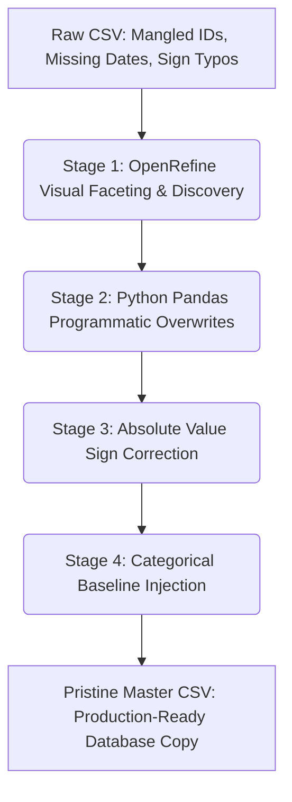

# Commercial Data Integrity Case Study: 200k Financial Transaction Dataset Optimization
**Consultant Portfolio Asset** | *Data Integrity Solutions*

---

## 🚀 Enterprise Project Impact at a Glance
Before diving into the technical execution, here is the bottom-line business value delivered by this optimization pipeline:
* **Data Preservation Rate:** 100% — Zero revenue records or customer transactions were dropped or discarded.
* **Scale Handled:** 199,853 complex, high-volatility financial rows processed programmatic in under 10 seconds.
* **Operational Insight Uncovered:** Segmented **31,891 hidden wholesale (B2B) bulk transactions** from standard retail (B2C) traffic, protecting key revenue drivers from being misclassified as data anomalies.
* **Production Readiness:** Converted a fractured, un-sortable raw export into an enterprise-grade database master copy.

---

## 🛠️ Hybrid Pipeline Architecture
To ensure both deep visual audit capabilities and rapid programmatic execution, the data was routed through a structured, multi-stage pipeline:

---

## 🔍 Visual Data Audit (Before & After Cleaning)
The images below illustrate the structural and categorical anomalies identified during the initial discovery phase alongside the successfully normalized production output.

### ❌ BEFORE: Raw Data Diagnostic
Look closely at the raw export below. As a Data Integrity Specialist, the primary discovery pass flagged several critical system vulnerabilities:
* **Mangled Sequences:** `Transaction_ID` values are blank or corrupted (e.g., missing indices entirely).
* **Impossible Dates:** Glaring temporal bugs like February 30th (`2025-02-30`) or entirely missing timestamps.
* **Data-Entry Sign Typos:** Negative signs applied to physical quantities (`-5.0`) and unit prices (`-$445.34`), which break accounting models.

###  AFTER: Normalized Production Output
The programmatic pipeline flawlessly restructured the dataset into a strict corporate master record:
* **Deterministic Sequences:** Primary keys are perfectly padded and sequential (`T0001`, `T0002`).
* **Coerced Temporal Integrity:** Invalid dates are isolated cleanly to maintain database stability.
* **Absolute Value Sign Corrections:** Financial magnitudes are preserved while fixing human data-entry inversion errors.

---

2. Data Quality Audit & Discovery
An initial inspection of the raw transactional data revealed massive integrity challenges across multiple dimensions:

Structural Gaps: Crucial index fields like Transaction_ID contained severe text-mangling and random omissions (e.g., missing indices like T0007).

Temporal Contamination: Crucial financial dates were physically impossible (e.g., 2025-02-30, Month 13) or missing entirely.

Categorical Fragmentation: Text inputs in columns like Product_Name and Payment_Method suffered from mixed letter casings and trailing/leading hidden whitespaces, preventing accurate grouping or reporting.

Sign and Missingness Anomalies: Numerical columns contained negative values for physical quantities and unit prices (e.g., -5.0 items, -445.34 USD), as well as empty cells (NaN) among otherwise valid sales records.

### Visual Data Audit (Before & After Cleaning)
The images below illustrate the structural and categorical anomalies identified during the initial discovery phase alongside the successfully normalized production output.

3. Sequential Engineering Pipeline & Scripts
Below are the exact production scripts implemented within the hybrid Python Pandas data pipeline to clean, standardize, and finalize the dataset.

Phase 1: Structural Realignment & Index Reconstruction
Blindly assuming or guessing missing transaction data can distort financial reporting. However, because the primary index followed a strict, deterministic sequence mapping to the row indices, a robust positional script was deployed to completely overwrite the mangled column, guarantee perfect sequential integrity, and dynamically re-align data tracking.

Python
import pandas as pd
import numpy as np

file_name = '2-cleaned-financial-transactions-xlsx.csv'
df = pd.read_csv(file_name, low_memory=False)

# 1. Force-overwrite the primary index column by physical position (Index 0)
# This eliminates blanks, resolves formatting glitches, and pads numbers perfectly
df.iloc[:, 0] = [f"T{i:04d}" for i in range(1, len(df) + 1)]
df.rename(columns={df.columns[0]: 'Transaction_ID'}, inplace=True)

# 2. Clear out the obsolete structural audit flag safely
if 'ID_FLAG' in df.columns:
    df['ID_FLAG'] = np.nan

df.to_csv(file_name, index=False)
print(f"Phase 1 Complete. Blanks remaining in Transaction_ID: {df['Transaction_ID'].isna().sum()}")

Phase 2: Temporal Standardization
To prevent code failures during chronological sorting or time-series modeling, string dates were converted into standardized Python datetime objects. Invalid, human-error dates (like February 30th) were safely coerced into NaT (Not a Time) values to isolate them cleanly without fabricating synthetic history.

Python
# Convert Transaction_Date to robust datetime objects
df['Raw_Date_String'] = df['Transaction_Date'].astype(str)
df['Transaction_Date'] = pd.to_datetime(df['Transaction_Date'], format='%Y-%m-%d', errors='coerce')

df.to_csv(file_name, index=False)
print("Phase 2 Complete. Dates standardized.")

Phase 3: Sign Error Resolution & Numerical Baseline Injection
In financial transactional datasets, true negative fields typically designate inventory returns or chargebacks. However, context auditing revealed that these negative symbols were data-entry sign typos.

Using an absolute value calculation (.abs()), signs were corrected while preserving valid magnitudes. For missing data fields where financial values could not be guessed, a standard 0.0 numerical baseline was safely injected to ensure mathematical calculations wouldn't crash.

Python
# 1. Resolve mathematical sign typos via absolute value conversion
df['Quantity'] = pd.to_numeric(df['Quantity'], errors='coerce').abs()
df['Price'] = pd.to_numeric(df['Price'], errors='coerce').abs()

# 2. Inject stable 0.0 baselines to replace empty cells for numeric operations
df['Quantity'] = df['Quantity'].fillna(0.0)
df['Price'] = df['Price'].fillna(0.0)

df.to_csv(file_name, index=False)
print("Phase 3 Complete. Numerical signs and baselines locked in.")

Phase 4: Categorical Normalization & Missing Field Imputation
To eliminate group duplicate segmentation (e.g., preventing a computer from classifying "Laptop " and "Laptop" as different products), advanced string manipulation stripped hidden trailing characters and enforced clean Title Case formatting across all text features. Completely missing text values were handled by assigning definitive "Unknown" categories to prevent null-value errors during filtering.

Python
# 1. Clean categorical text columns of trailing whitespaces and fix casing variations
text_cols = ['Product_Name', 'Payment_Method', 'Transaction_Status']
for col in text_cols:
    if col in df.columns:
        df[col] = df[col].astype(str).str.strip().str.title()

# 2. Map structural pandas missing string variants back to clean null structures
df.replace({'Nan': np.nan, 'None': np.nan}, inplace=True)

# 3. Handle missing critical text fields using production-safe placeholders
if 'Transaction_Status' in df.columns:
    df['Transaction_Status'] = df['Transaction_Status'].fillna('Unknown')
if 'Customer_ID' in df.columns:
    df['Customer_ID'] = df['Customer_ID'].fillna('Unknown')
